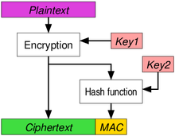

# Quick Reference for Blockchain using HMAC and AES Full Encryption at-rest

This quick example code implements a possible reference for blockchain implementation, which is a Merkel tree with history, using HMAC and full encryption at-rest.

The history has been saved in the form of a linked list within the Merkel tree, and a timestamp. 

This example is an enhancement of the HMAC example which has been presented in other sections. See this [link](../hamc/README.md) for more information on that example.

Here are the specific enhancements in this exercise:
1. _Introduction of Confidentiality:_ 
   - The individual node's content is fully encrypted at-rest. 
   In prticualar HMAC with encryption will be used as true confidentiality can 
   not be achieved only via encryption without message data authentication, 
   given by the HMAC. This is also called _authenticated encryption_. In 
   particular, we will use two separate security services for encrypting and 
   HMAC (reuse of the previous example). We will perform in this order 
   **Enrypt-then-MAC**[^1]:
	   - The Nodes are encrypted.
	   - The HMAC is computed on the combination of the ciphertext and the 
	   associated data 
	   - The ciphertext the associated data and the HMAC are used/sent 
   
   On the user/receiver front, the operations are relatively simple:
	   - Check the HMAC on the ciphertext. If the check fails, the 
	   user/receiver will reject the message without the need to decrypt it
	   - Decrypt the message[^2] 

## Additional enhancements for further exercises

Up until now we have explored three important security services:

1. data integrity
2. data authentication 
3. confidentiality

Additional excercises might be considered in respect of further developing/experiment the other two left security services:

4. _Introduction of the concept related to authenticity and non-repudiation:_
   - The nodes have been digitally signed at creation. 
   - Creation and loading of the tree has been separated from the `main()` 
   function and from the testing activity
   - The tree creation will be done as a separate procedure after the 
   initialization 
5. _Introduction of the concept of Authentication:_
   - The Loading of the three information is simulated with the `checkSignature()`
   operation which verify the identy of the requestor and runs through all the
   nodes thier digital signature. It simulates what in _real life_ would be a 
   _strong_ integrity check over authenticity and authentication.

Finally we could exercise the following scenario:

 _Introduction of the concept of Authority:_
   - Once a user has been authenticated for loading/accessing the tree 
   information, the next step is understanding the authority for that user to 
   carry out operations such as insertion/deletion and information printout.


## Problem to solve for this excersice 

We want to implement _Autenticated Encryption_ (AE) on top for the excercise we have developed on the [HMAC excercise](../hmac). As we have seen as in the HMAC excercise, the HMAC cryptographic primitive is guarantying Message Athentication and Data integrity, but the data have been manipulated always in clear (i.e. without encryption). Now we want to introduce an additional layer of security: data encryption at-rest, at leaset for some node's fields in the data structure.

## Data Origin Authentication vs Authenticated Encryption

In the [HMAC README file](../hmac/README.md) we have learned the difference between data integrity and data autherication and in particular how the latter include the former. Now we want to include an additional level of security: encryption and decryption. In our example we will use two different security services for the encryption/decryption and the HMAC operation (i.e. the message authentication). In particular we will used the concept of **Encypt-then-MAC/Authenticate** or simply **EtM**. The concept is brilliantly enlighted by the self explanatory image[^3]



You might have noticed the use of two separate keys for the distinctive security services, one associated with encryption and the other one with authentication. This is a best-practice in security to have individual keys for separate security services. Although, there are algorithms that are capable to absolve the encryption and the authentication security services all in one security services. In that context it might make perfect sense to use only one key. In our case, though, we have to used two separete keys and those two keys is better to be separated. We will see later, how this will include an extra layer of complexity which will be solved with another key generated in a similar way like the previous key. They are two independent and separate keys, though.

### Symmetric Key and ownership
A sensible owner of the symmetric keys seems to be at the tree structure level. It would not make too much sense to bure the keys into the node level as they are not the owners. But this decision comes with some redesign which will be addressed in the next section. Key generation can be assisted with the following Pseudo-Random Number Generation (PRNG) as follow:

	// initialise PRNG for key generation
	srand(time(0));
	// use PRNG to extract a pseudo-random value
	// for our symmetric key 
	key = rand();	

This is just to illustrate the mechanism; in real life, keys are unlikely to be stored as clearly and plainly as in this example. They normally require hardware support, such as Hardware Security Modules (HSM).

Nevertheless, special attention has been given not to share the value contained in the varaible `key` publicly outside the class. The use of `getKey()` and `getAESKey()` member functions are only private, so it can not be publically used. This approach has had some bearing on how the software has been organized and architected. In particular one public member fuction has been called each time a new Node in the tree is created to commission the nodes itself without exposing the key value. 

       NodeCell<I,S>* commissionObject (I i, pS &obj) {
		   NodeCell<I,S> *p= new NodeCell<I,S> (getKey(),
			                                    getAESKey(),
					                            i, obj);
	       p->commissionNode(getKey(),
		                     getAESKey());
	
	  	   return p;
       }

This means commissioning the Nodes at the tree level and passing the keys value to `LibAccess` abstarct class with the dedicated virtual member class:

	 virtual void commissionClass (size_t, string) = 0;

where `seed` and `aes_key` are protected variables; therefore, the `Student` and `Prof` derived classes inherit the variables; but it is not visible outside the classes. Each class then has their own implementation of the `commissionClass()` function which will install the value into `seed` and `aes_key`, respectively.

It is important to distiguish the creation of the class from the commissioning of it; hence the separation of the two activities. In the function `commissionObject()`, these two activities happen immediately after the other; but that might not be the case necessarily.


## How to solve the exercise

The tree class is now composed of four major information block

1. The tree nodes: with the LibAccess abstract class pointer, the index, and the pointers - left and right - to the children on the left and right

2. The control structure for checking its integrity: today it is implemented via a likened list, containing the hash fingerprint at each key action throughout the tree's life, and a timestamp for when the action has been taken.

3. The symmetric key for the HMAC, created when the tree data structure has been created, and passed down to the rest of the NodeCell

4. The simmetric key for AES encryption/decryption _at-rest_ done at the node level[^4]


### The tree nodes

The abstract class described in _libUsers.hpp_ has been taken from previous examples and offers the advantages of abstracting two other classes - Students and Profs - which encapsulate a specific family of Hash Funtions: `HMAC_SH3`. The `HashFunctions` abstract class represents the whole family of hash funtions, from which specific Hash function implementations may be derived. In this example, the low-level function implementing the virtual method is relatively simple in the `HMAC_SH3` derived class and takes two fields, the _key_ coming from the tree structure and a pointer to the node (in the abstract form of `LibAccess`[2]). This last parameter will allow to reach _index_ and _name_, which are used as input to the Hash256 (SHA-3) standard template library function. Furthermore, the  AES encryption at-rest is switched on and off thanks to the compilation function in the `CMakeList.txt` as follow:

```
   # Define AES_ENCRYPT to inclde symmetric encryption and
   # decryption of data/nodes at-rest
   option(AES_ENCRYPT "Include Encryption and Decryption" TRUE)
```

For the benefit of this exercise, we have included only one Prof, at the root and some other students down below.

During the tree construction, in the `main()` function, the same name for the students has been chosen, so that the only differentiation on the Hash input is the sequence/serial number. We will realise that, even in this constrained scenario, the Hash() function works pretty well on differentiating the data structure, and ultimately the tree fingerprint.

#### Rearchitecting the Classes
Since we have identified the Hash function as a module we want to expand on, it is appropriate to give more modularity and flexibility. Here is how we would like to rearchitect the module:

_High-Level Architecture (abstract classes):_


	Class LibAccess {                      Class HashFunctions {
	    virtual string getHash () = 0;         virtual string formHash(LibAccess*) = 0;
	};                                     };

_Mid-Level Architecture:_
                                                                          
	Class  Prof: public LibAccess {         
				  private:                                       
				    HashFunctions *pHash;          
				  };                                                                  
				      
_Low-Level Architecture:_                                                              
                                                                                    
	                                                     Class HMAC_SH3: public HashFunctions {
									                       string formHash(LibAccess *p) {
														   ...
														   ...
														   }
												         };                                                 

This re-architecture allows now to abstract a class function related to the Hash, but also be more specific concerning the implementation of the Hash function at the low level, with the `HMAC_SH3` class. This is achieved without necessarily duplicating the efforts in the two classes that use the Hash function, Student and Prof.


Another advantage gained is that we could define which Hash function any given class should use at the initialization time. In fact, by default, we use the HMAC_SH3, but in theory, we could use another Hash family function by adding a new module equivalent to the `hmac.hpp`. Here are the two constructors for each class:

	Prof (string s): name(s), serialNP(++profSerialNum), active(true) {
    pHash = (HashFunctions*) new HMAC_SH3();
	}

	Prof (string s, HashFunctions* & p): name(s),
				       serialNP(++profSerialNum),
				       active(true) {
    pHash = p;
	}

The first one is used in our example here. The second one could be used in case we want to define another Hash function for the future, for example, one based on Post-Quantum Cryptography (PQC) algorithms.

To be noted that a similar Software architecture could have been used for the AES encryption and decryption functionality. But in this instance we prefered to adopt a more pragmatic approach.

### The Tree fingerprints

As already discussed, the fingerprints for the hash tree have been determined by the function:

	string fingerPrint()
	
which is calling 

	string computeHash(string& buffer, NodeCell<I,S> *r) 

within the `HTreeClass`. In there the value coming from the implemented abstract class `formHash()` - either Student or Prof - is used to combine a sequence in each of the branches, on the right and the left, and then calculated together as an input to another Hash256 (SHA-3) function to create the unique tree's fingerprint for a given data structure configuration of the tree. It is fair to assess the following:

- the fingerprint is different for each tree's node configuration
- Given the **same** tree structure in two **different times**, its fingerprint has to coincide.

In particular, we will prove both points in this exercise. 

The first one, while creating/building the tree from scratch, we will notice the fingerprint is always changing.

The second point is demonstrated by inserting a leaf node, as last and then immediately removing it at the next action. The reader would agree that the tree node structure configuration is the same before and after the last leaf node has been inserted and successively removed. So the expectation is that the tree's fingerprint remains the same, although two distinctive operations have been carried out which forced to recalculate the tree's fingerprint. See the output in this example - demostrating both points -:


	TREE PRINTOUT - root: 0x55c2d58fb320->548
	History - # events:19
	=============

	 timestamp: 2527	 tree hash signature: 10017358643272133223
	 timestamp: 2580	 tree hash signature: 8645415796858111250
	 timestamp: 2600	 tree hash signature: 17290831593716222760
	 timestamp: 2626	 tree hash signature: 16134919113722894424
	 timestamp: 2651	 tree hash signature: 16134919113722894688
	 timestamp: 2677	 tree hash signature: 7489503316864783304
	 timestamp: 2743	 tree hash signature: 16134919113722895340
	 timestamp: 2897	 tree hash signature: 3166795418435727876
	 timestamp: 2944	 tree hash signature: 7489503316864783994
	 timestamp: 2996	 tree hash signature: 16134919113722896386
	 timestamp: 3028	 tree hash signature: 16134919113722896508
	 timestamp: 3062	 tree hash signature: 11812211215293840442
	 timestamp: 3094	 tree hash signature: 16134919113722896839
	 timestamp: 3127	 tree hash signature: 16134919113722897278 <--+
	 timestamp: 3212	 tree hash signature: 16134919113722897404    |-- same tree structure
	 timestamp: 3355	 tree hash signature: 16134919113722897278 <--+
	 timestamp: 3393	 tree hash signature: 11812211215293840881
	 timestamp: 3469	 tree hash signature: 7489503316864784930
	 timestamp: 3505	 tree hash signature: 3166795418435728799


This is all fine for checking the tree's integrity. But what about the history? For this, we have used a linked list, whose nodes are formed by the tree's fingerprint at a specific time and the timestamp of when the fingerprint has changed. Now, for what we said before there are only two operations which will force a tree's fingerprint change: the insertion and the deletion with the functions `insertNew` and `delNode` respectively. In fact, in those two functions the following code has been added:


	...
	HashCell<time_t,string> tmp (clock(),
				                 fingerPrint());
	return rHash.insertNew(tmp);
	}


These lines will make sure that the tree's hash/fingerprint is recalculated - in the first line -, and it has been used to increment the _history_ linked list which is part of the tree private control structure/variable `rHash`  
  
Furthermore, a service route to check the tree integrity has been introduced to check anywhere at any time that the tree integrity is preserved. That function recalculates the hash tree in that moment and checks with the latest element in the linked list, which should be the most current event that happened. If the two values are different we can consistently say that the tree's data integrity has been compromised.

There might be two possible ways to check that this is happening:

1. changing the _name_ and/or the serial number, _serialNP/S_ for any element in the tree
2. omitting the hash recalculation (the two lines above) after one of the two operations of inserting and/or deleting.

We have tested both of these scenarios. The first one with a dedicated testcase at the end of the `main()` function simulating a data tampering ina  given node. In particual, it is possible not only to detect that the data tree structure has been tampered, but also be specific on which element has been tampered. See output example in here:


	Searching for node: 
		index: 350  	User name :pinco pallo	Serial Number: 15	active: Yes
	Hash : ed8304b138c3358a	left: 0	right: 0
	Tree's fingerprint before:	43548bdd14a6e0f4|042cde1be71d3fb5|7e6b4e23f74205e3|```840d2e177495731a```|07957a48051a9cff|556a214d303c24ca|556a214d303c24ca|823421da22b7e997|f16e0295dcec2d4a

	Data before manipulation: 
		User name :pinco pallo	Serial Number: 5	active: Yes
	Hash : ```840d2e177495731a```

	Data after manipulation: 
		User name :Data Integrity Breach - Test	Serial Number: 16	active: Yes
	Hash : ```fdaae4d17a96dfee```
	Tree's fingerprint after:	43548bdd14a6e0f4|042cde1be71d3fb5|7e6b4e23f74205e3|```fdaae4d17a96dfee```|07957a48051a9cff|556a214d303c24ca|556a214d303c24ca|823421da22b7e997|f16e0295dcec2d4a
	!! INTEGRITY COMPROMISED !! -- Test passed 


The second point is proved by omitting the hash recalculation from the delete function and verifying that the `integrityCheck()` function returns an error.

For reference, here is the implementation of the `integrityCheck()` function:

	bool integrityCheck() {
	  string buffer;
	  return ( computeHash(buffer, root) ==
	           (rHash.findLast()->hashValue) );
	}

 

### The symmetric key for the HMAC
As we discussed in the previous section, the key's owner has to be necessarily the tree structure. Therefore an additional variable has been declared which will be created at the Tree constructors and passed down to the lover level at the abstract class `LibAccess` to be used in the HMAC function for their class. 

Had we wanted to use the crypto++[^5], the HMAC could have looked like the following definition:

	Digest<HMac<SHA256>>      digest;
	HMAC< SHA256 >            hmac;

and used as follows, in creating the digest:

	hmac.hash("This is the Key", "This is the message", digest);

In this experiment we have used our own definition using `rand()` and `srand()`, for the HMAC key generation and for the HMAC we use two different implemetation:
- Internally generated
- Coming externally from a public library

to switch between the two implemetation in the `CMakeList.txt` file toggle the `STD_HMAC` option to switch from one to the other (default is the external option).

## The use of the Binary tree and the Linked list in a template format 

It makes it easy to reuse the work done in other exercises for this specific example. The format to accept any type of node structure makes the extension to the abstract class very easy[^6].  The user can define the node completely independently at run time. The only constraint is related to the implicit need for the _index_ field to satisfy some order, typically with the overload of the '< > = ' operators. This index is typically different from the serial number of the users, as the index is a control field for the binary tree and the serial number can be used for checking the user identity, instead.

Only one attention: since an abstract class can not be instantiated, we have used _typedef_ to include a pointer to the abstract class as the information stored in the nodes tree. This is predicated on the fact that either the Professor or the Student records are created upfront and then we use the pointer to the abstract class for each of those in the tree's nodes. This is in line with a real case example where, normally the requirement to store information about Students and Professors is stored differently than from those who need to manage access to the University Library. Thanks to the Abstract class concept in C++ it is possible to share only the information needed for the two environments. It is a sort of interface that those two classes have to the Library to access the building. In fact, in C++, an interface is usually defined as a virtual class in which *all* its member functions/methods are virtual. Those virtual methods are defined as the minimum that the _user_ -in this context the University Library - would need to manage access to the building.

Thanks to Abstract class the tree is composed of Professors, with the name "Cicero", and Students, with the name "pinco pallo". Both are part of the binary tree because the tree node points to the abstract class, which is the common part of those two classes.

Typically, we have included one professor, as root at the beginning; then all others are students. 

In the deletion, we show some examples of how internal and leaf nodes/students got removed from the tree. And finally, we get rid of the root, the professor (with no offence).

Please refer to the treeTemplate example for more information about the binary tree data structure.


There is also a quick example on `main()` function on how to use the `TreeClass<>` object, a small exercise on including nodes, searching dedicated nodes and removing them. The same code is also used as a regression test in the `.yml` file for the Continuous Integration (CI). This is why the `main()` function returns 0 or 1 according to the successful, or unsuccessful, completion of the tasks.

Lastly, the implementation of the linked list as a template, it makes simple to generalise the node structure with `time_t` and `string`, for the timestamp and the hash respectively. 

The code has been written for C++11, but there is no clear dependency and can be compiled on other toolchains, but we have not tested it.


## Compiling
Assuming GCC v.11 and cmake already installed

Only for the first time run the following:

`$ cmake . `

Then successive builds like that:

`$ cmake --build . `

The name of the file to compile and the project are identified in the `CMakeLists.txt` file. 
Output is the executable `myBlockchainExample` generated after the build.


[^1]: See Wikipedia at this [link](https://en.wikipedia.org/wiki/Authenticated_encryption) or this good reference: []()
[^2]: Note that the encryption operation and the HMAC operation will need to be computed using _different_ cryptographic keys. This is becuase they are two separate cryptographic operations, providing different security services. Using different keys follows the best practises principles of keys separations  
[^3]: Thanks to [Wikipedia](https://en.wikipedia.org/wiki/Authenticated_encryption)
[^4]: It has to be noted the differnece between the AES symmetric key and the _initialization vector (iv)_ which comes into the initialization of the ctx structure. The Key is the symmetic key used in the security service, wehreas the _iv_ is and optimization factor for the AES algorithim. This last one is fine to be controlled locally at the node level.

[^5]: see link in [here](https://www.cryptopp.com/wiki/HMAC) and [here](https://www.cryptopp.com/docs/ref/class_h_m_a_c.html)
[^6]: The tree structure relies on this abstract implementation to get the hash of the leaf nodes in the markel tree implementation and use them to combine and form that unique fingerprint which is specific to the tree structure, as we will see later in the next chapter
